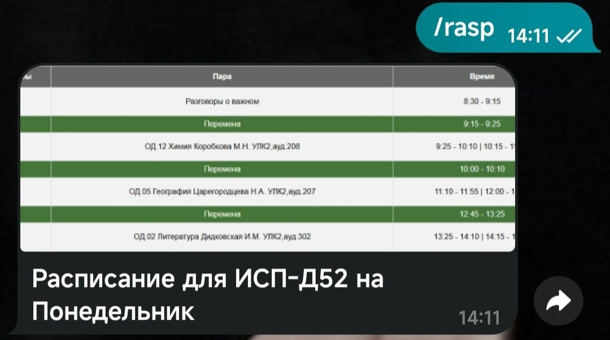
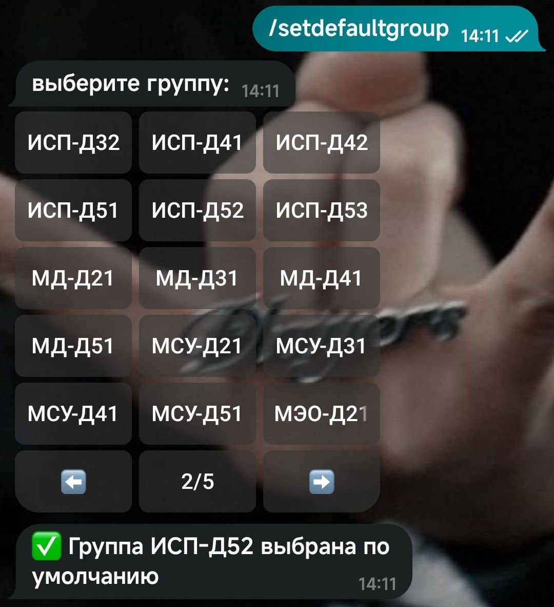
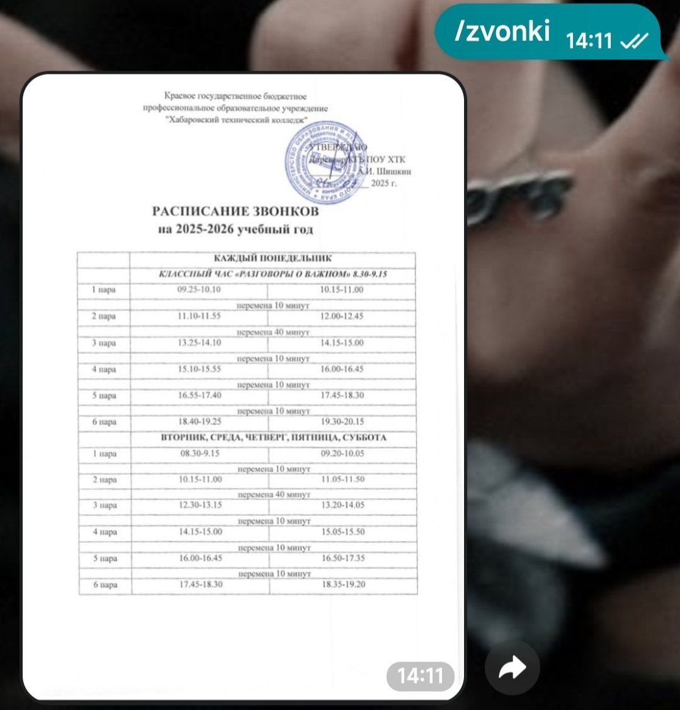

# 🤖 ScheduleBotHTK

<div align="center">


### Telegram-бот для удобного просмотра расписания занятий

<p>
  
  
  
  
</p>

**Быстрый доступ к расписанию, звонкам и информации о занятиях прямо в Telegram.**

</div>

---

## 📌 О проекте

**ScheduleBotHTK** — это Telegram-бот, разработанный для автоматизации просмотра учебного расписания.
Проект предоставляет студентам быстрый и удобный доступ к:

* 📅 расписанию занятий;
* ⏰ времени звонков;
* 👥 выбору группы;
* ℹ️ дополнительной информации;
* 📊 обработке Excel-файлов с расписанием.

Бот написан на **Java** с использованием библиотеки **TelegramBots API** и поддерживает работу с `.xlsx` файлами через **Apache POI**.

---

# ✨ Возможности

## 📚 Работа с расписанием

* Получение актуального расписания;
* Поддержка нескольких групп;
* Удобная навигация через inline-кнопки;
* Автоматическая обработка Excel-таблиц.

## ⏱ Информация о звонках

* Просмотр времени начала и окончания пар;
* Поддержка разных расписаний звонков.

## ⚙️ Гибкая архитектура

* Разделение логики по сервисам и обработчикам;
* Конфигурация через `.env`;
* Логирование ошибок и событий;
* Масштабируемая структура проекта.

---

# 🖼 Демонстрация работы

## 📅 Просмотр расписания

> Здесь можно разместить скриншот отображения расписания



---

## 👥 Выбор группы



---

## ⏰ Информация о звонках



---

# 🏗 Архитектура проекта

```text
src
 └── main
     ├── java
     │   └── ru/stavarachi
     │       ├── app
     │       ├── config
     │       ├── handler
     │       ├── model
     │       ├── repository
     │       ├── service
     │       └── util
     └── resources
         ├── images
         └── tabels
```

---

# 🛠 Используемые технологии

| Технология       | Назначение                |
| ---------------- | ------------------------- |
| Java 26          | Основной язык разработки  |
| TelegramBots API | Работа с Telegram Bot API |
| Apache POI       | Чтение Excel-файлов       |
| Playwright       | Автоматизация и обработка |
| SLF4J + Logback  | Логирование               |
| Maven            | Сборка проекта            |

---

# 🚀 Запуск проекта

## 1️⃣ Клонирование репозитория

```bash
git clone https://github.com/USERNAME/ScheduleBotHTK.git
cd ScheduleBotHTK
```

---

## 2️⃣ Создание `.env`

Создайте файл `.env` в корне проекта:

```env
BOT_TOKEN=your_bot_token
BOT_USERNAME=your_bot_username
```

---

## 3️⃣ Сборка проекта

```bash
mvn clean install
```

---

## 4️⃣ Запуск бота

```bash
mvn exec:java
```

или через запуск класса:

```text
ru.stavarachi.Main
```

---

# 📂 Работа с расписанием

Файлы расписания размещаются в директории:

```text
src/main/resources/tabels/
```

Поддерживаются Excel-файлы формата:

```text
.xlsx
```

---

# 📑 Логирование

Логи приложения сохраняются в:

```text
/logs/error.log
```

Настройка логирования находится в:

```text
src/main/resources/Logback.xml
```

---

# 🔮 Планы по развитию

* [ ] Получение расписания на день вперед
* [ ] Получение расписания на любой день
* [ ] Темная тема для расписания

---

# 🤝 Вклад в проект

Pull Request'ы и предложения приветствуются.

Если вы хотите улучшить проект:

1. Сделайте Fork;
2. Создайте новую ветку;
3. Внесите изменения;
4. Отправьте Pull Request.

---

# 📄 Лицензия

Проект распространяется под лицензией MIT.

---

# 👨‍💻 Автор

**ScheduleBotHTK** разработан в качестве проекта для автоматизации учебного процесса.

<div align="center">

### ⭐ Если проект понравился — поставьте звезду репозиторию ⭐

</div>
