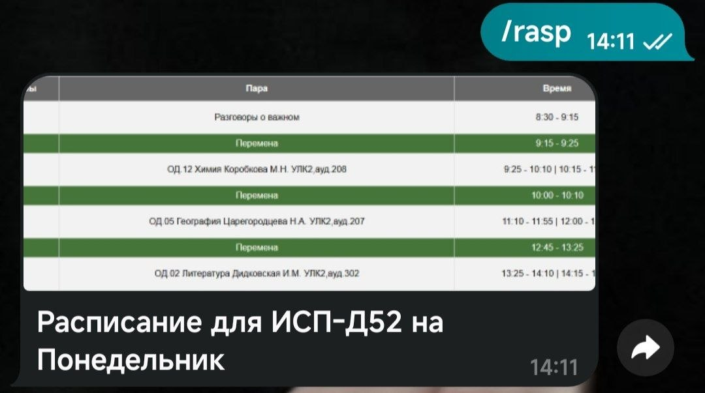
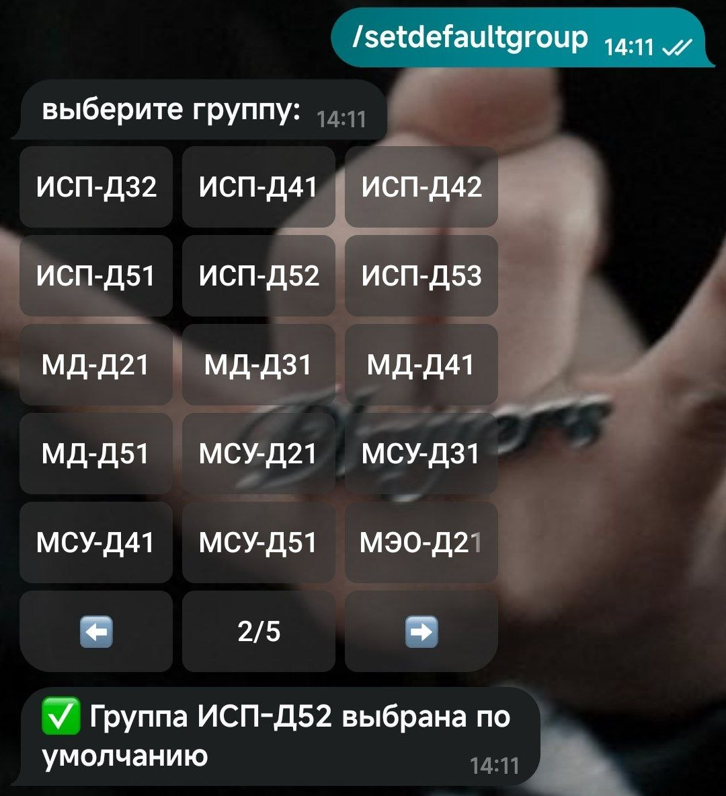
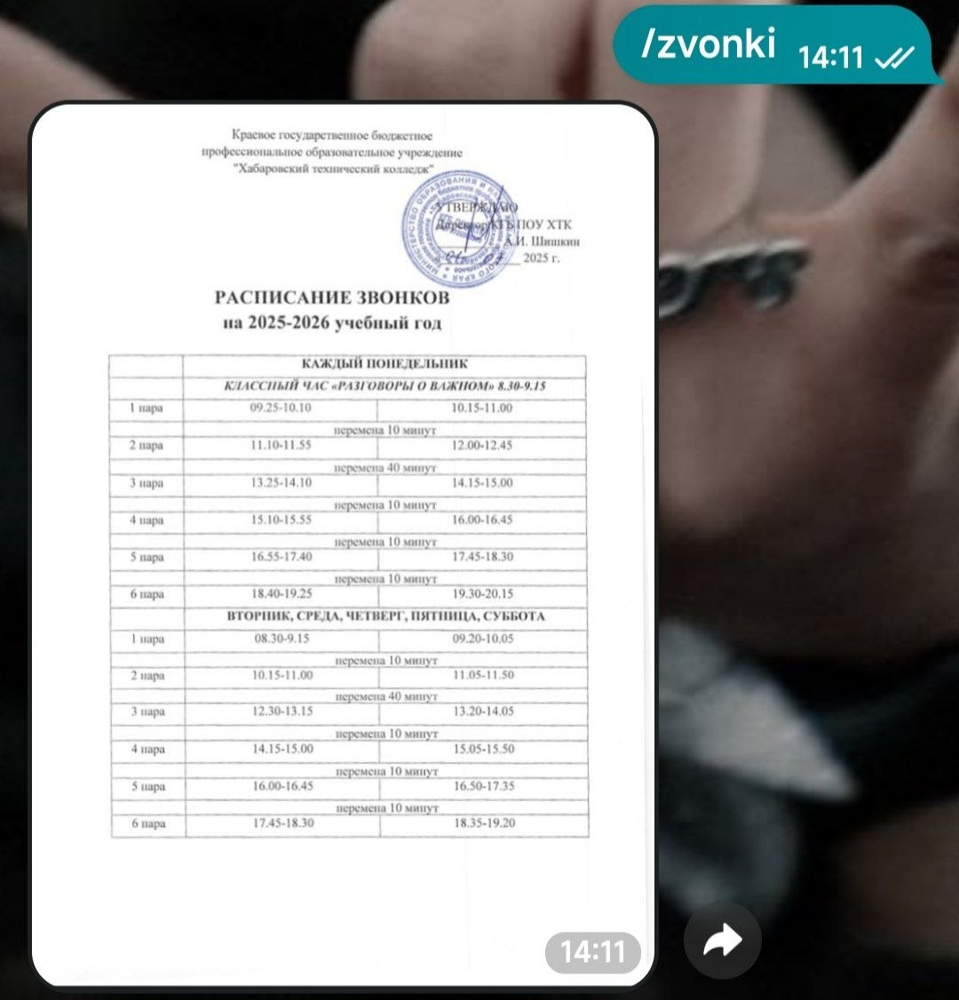

# 🤖 ScheduleBotHTK

<div align="center">


### Telegram-бот для студентов ХТК, предоставляющий актуальное расписание занятий, замены, информацию о звонках и настройку групп непосредственно в Telegram.

<p>
  
  
  
  
</p>

**Быстрый доступ к расписанию, звонкам и информации о занятиях прямо в Telegram.**

</div>

---

## 📌 О проекте
**ScheduleBotHTK** — Telegram-бот для студентов ХТК, предназначенный для получения актуального расписания занятий и замен.

Бот автоматически загружает и обрабатывает Excel-файлы расписания, хранит выбранные пользователем группы и предоставляет быстрый доступ к учебной информации через Telegram-интерфейс.

Основные функции:

- просмотр расписания занятий;
- просмотр замен;
- информация о звонках;
- сохранение выбранной группы;
- автоматическая загрузка данных из внешних источников;
- обработка Excel-файлов через Apache POI.

Бот написан на **Java** с использованием библиотеки **TelegramBots API** и поддерживает работу с `.xlsx` файлами через **Apache POI**.

---

# ✨ Возможности

## 📚 Работа с расписанием

* Получение актуального расписания;
* Поддержка нескольких групп;
* Удобная навигация через inline-кнопки;
* Автоматическая обработка Excel-таблиц.

## 📥 Автоматическое обновление расписания

* Загрузка расписания с Яндекс.Диска;
* Обработка публичных ссылок;
* Автоматическое получение актуальных Excel-файлов;
* Поддержка расписания замен.

## ⏱ Информация о звонках

* Просмотр времени начала и окончания пар;
* Поддержка разных расписаний звонков.

## ⚙️ Гибкая архитектура

* Разделение логики по сервисам и обработчикам;
* Конфигурация через `.env`;
* Логирование ошибок и событий;
* Масштабируемая структура проекта.

---

# 🖼 Демонстрация работы

## 📅 Просмотр расписания



---

## 👥 Выбор группы



---

## ⏰ Информация о звонках



---

# 🏗 Архитектура проекта

```text
src
└── main
    ├── java
    │   └── ru.stavarachi
    │       ├── app
    │       │   ├── Application.java
    │       │   └── BotApplication.java
    │       │
    │       ├── config
    │       │   ├── AppConfig.java
    │       │   ├── BotConfig.java
    │       │   ├── PathConfig.java
    │       │   ├── ScheduleConfig.java
    │       │   ├── StorageConfig.java
    │       │   └── ResourceLoader.java
    │       │
    │       ├── handler
    │       │   ├── CommandHandler.java
    │       │   ├── GroupCallbackHandler.java
    │       │   └── ClientHandler.java
    │       │
    │       ├── service
    │       │   ├── ScheduleService.java
    │       │   ├── ExcelService.java
    │       │   ├── ExcelChangeService.java
    │       │   ├── FileDownloadService.java
    │       │   ├── UserSettingService.java
    │       │   ├── GroupKeyboardService.java
    │       │   ├── BotCommandService.java
    │       │   ├── CallService.java
    │       │   ├── InfoService.java
    │       │   └── SixSevenService.java
    │       │
    │       ├── repository
    │       │   ├── ExcelRepository.java
    │       │   ├── ExcelChangeRepository.java
    │       │   └── UserGroupRepository.java
    │       │
    │       ├── client
    │       │   └── YandexDiskClient.java
    │       │
    │       ├── downloader
    │       │   └── FileDownloader.java
    │       │
    │       ├── parser
    │       │   └── PublicLinkParser.java
    │       │
    │       ├── model
    │       │   ├── User.java
    │       │   ├── Pair.java
    │       │   ├── Break.java
    │       │   └── Change.java
    │       │
    │       └── util
    │           ├── MessageUtil.java
    │           ├── HtmlUtil.java
    │           ├── HtmlDarkThemeUtil.java
    │           └── TimeUtil.java
    │
    └── resources
        ├── images
        └── tabels
```

# Назначение пакетов

| Пакет        | Ответственность                                         |
| ------------ | ------------------------------------------------------- |
| `app`        | Точка входа и запуск приложения                         |
| `config`     | Конфигурация приложения, путей и бота                   |
| `handler`    | Обработка команд и callback-запросов Telegram           |
| `service`    | Основная бизнес-логика приложения                       |
| `repository` | Работа с данными расписания и настройками пользователей |
| `client`     | Взаимодействие с внешними API                           |
| `downloader` | Загрузка файлов расписания                              |
| `parser`     | Парсинг публичных ссылок и данных                       |
| `model`      | Доменные модели приложения                              |
| `util`       | Вспомогательные утилиты                                 |


---

# 🛠 Используемые технологии

| Технология       | Назначение                |
| ---------------- | ------------------------- |
| Java 26          | Основной язык разработки  |
| TelegramBots API | Работа с Telegram Bot API |
| Apache POI       | Чтение Excel-файлов       |
| Playwright       | Автоматизация и обработка |
| SLF4J + Logback  | Логирование               |
| Maven            | Сборка проекта            |

---

# 🚀 Запуск проекта

## 1️⃣ Клонирование репозитория

```bash
git clone https://github.com/StavaRachl/ScheduleBotHTK.git
cd ScheduleBotHTK
```

---

## 2️⃣ Создание `.env`

Создайте файл `.env` в корне проекта:

```env
BOT_TOKEN=your_bot_token
BOT_USERNAME=your_bot_username
ADMIN_ID=your_telegram_user_id
```

---

## 3️⃣ Сборка проекта

```bash
mvn clean install
```

---

## 4️⃣ Запуск бота

```bash
mvn exec:java
```

или через запуск класса:

```text
ru.stavarachi.Main
```

---

# 📂 Работа с расписанием

Файлы расписания размещаются в директории:

```text
src/main/resources/tabels/
```

Поддерживаются Excel-файлы формата:

```text
.xlsx
```

---

# 📑 Логирование

Логи приложения сохраняются в:

```text
runtime/logs/error.log
```

Настройка логирования находится в:

```text
src/main/resources/Logback.xml
```

---

# 🤝 Вклад в проект

Pull Request'ы и предложения приветствуются.

Если вы хотите улучшить проект:

1. Сделайте Fork;
2. Создайте новую ветку;
3. Внесите изменения;
4. Отправьте Pull Request.

---

# 📄 Лицензия

Проект распространяется под лицензией MIT.

---

# 👨‍💻 Автор

**ScheduleBotHTK** разработан в качестве проекта для автоматизации учебного процесса.

<div align="center">

### ⭐ Если проект понравился — поставьте звезду репозиторию ⭐

</div>
